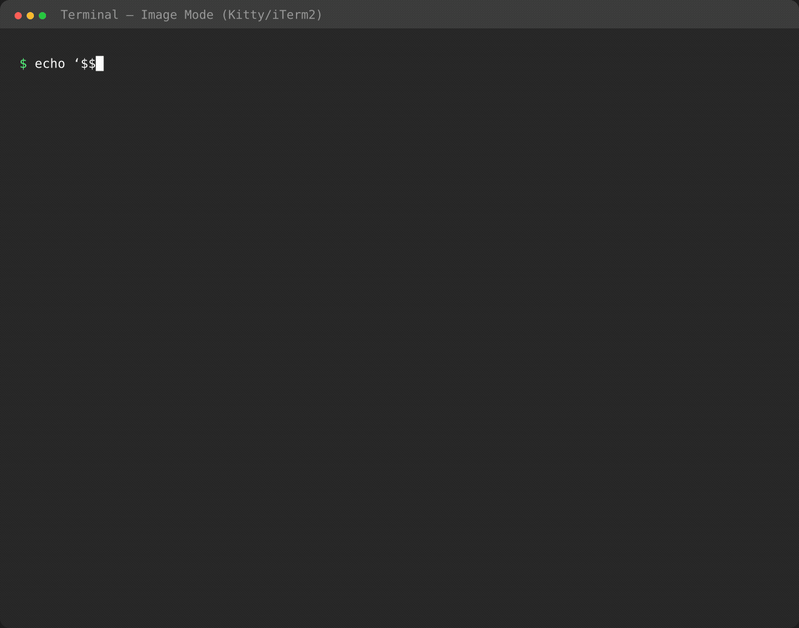

<div align="center">

# termula

**Beautiful math in your terminal.**

A pipe-friendly stream filter that renders LaTeX as Unicode art or inline images.

[](https://github.com/j-ito0625/termula/actions/workflows/ci.yml)
[](https://crates.io/crates/termula)
[](LICENSE)
[](https://www.rust-lang.org/)

[**Install**](#install) | [**Quick Start**](#quick-start) | [**AI Tools**](#use-with-ai-tools) | [**Terminal Support**](#terminal-support) | [**Contributing**](CONTRIBUTING.md)

</div>

---

<p align="center">
  
</p>

> termula detects LaTeX math in any text stream and renders it — as Unicode art in any terminal, or as crisp images in Kitty/WezTerm/iTerm2.

---

## Rendering Modes

<table>
<tr>
<td width="50%" valign="top">

### Image Mode

**Kitty / WezTerm / Ghostty / iTerm2**

Pixel-perfect math rendering via typst + mitex. Auto-detected by terminal capability.

`Kitty Graphics Protocol` `iTerm2 Inline Images`

</td>
<td width="50%" valign="top">

### Unicode Art Mode

**Any terminal**

High-quality text-based rendering via utftex. Works everywhere, no image support needed.

`Unicode Art` `ANSI Passthrough`

</td>
</tr>
<tr>
<td>

</td>
<td>

</td>
</tr>
</table>

---

<a id="install"></a>

## Install

```bash
cargo install termula
```

> **Dependencies:**
> - [utftex](https://github.com/nicokeywords/utftex) — Unicode art rendering (`brew install utftex`)
> - [typst](https://typst.app/) — Image rendering, optional (`cargo install typst-cli`)

<details>
<summary><strong>Homebrew (macOS)</strong></summary>

```bash
brew tap nicokeywords/tap
brew install termula
```

</details>

<details>
<summary><strong>Shell completions</strong></summary>

```bash
# Bash
termula --completions bash > ~/.local/share/bash-completion/completions/termula

# Zsh
termula --completions zsh > ~/.zfunc/_termula

# Fish
termula --completions fish > ~/.config/fish/completions/termula.fish
```

</details>

---

<a id="quick-start"></a>

## Quick Start

```bash
# Pipe mode — filter any text stream
echo '$$\int_0^1 x^2 dx = \frac{1}{3}$$' | termula

# Wrapper mode — spawn a command in a pty, intercept its output
termula -- your-command
```

---

<a id="use-with-ai-tools"></a>

## Use with AI Tools

> This is termula's primary use case — **making math readable in LLM CLI output**.

```bash
# Claude Code — wrap mode (preserves interactivity)
termula -- claude

# Pipe mode
claude | termula
aider | termula
```

Add this to your project's `CLAUDE.md` for best results:

```markdown
## Math Output
Output math using ```math blocks:

\```math
\int_0^1 x^2 dx = \frac{1}{3}
\```
```

---

<a id="terminal-support"></a>

## Terminal Support

termula auto-detects your terminal and picks the best rendering mode.

| Terminal | Mode | Quality |
|:---|:---|:---|
| **Kitty** | Image (Kitty protocol) | Best |
| **WezTerm** | Image (Kitty protocol) | Best |
| **Ghostty** | Image (Kitty protocol) | Best |
| **iTerm2** | Image (iTerm2 protocol) | Best |
| Any Unicode terminal | Unicode art | Good |
| Fallback | Inline Unicode / plain text | Basic |

```bash
termula -m kitty    # Force Kitty Graphics
termula -m iterm2   # Force iTerm2 inline images
termula -m unicode  # Force Unicode art
termula -m inline   # Force inline Unicode symbols
termula -m off      # Pass-through (no rendering)
```

---

## Delimiters

| Pattern | Example | Default |
|:---|:---|:---|
| ` ```math ``` ` | Markdown math blocks | On |
| `$$...$$` | Display math | On |
| `\[...\]` | LaTeX display math | On |
| `\(...\)` | LaTeX inline math | On |
| `$...$` | Inline math | Off (opt-in) |

> Inline `$...$` is off by default to avoid false positives with shell variables like `$HOME`. Enable with `termula -d all`.

---

## Architecture

```
                    stdin / pty
                        │
              ┌─────────▼──────────┐
              │      Scanner       │
              │                    │
              │  $$  ```math  \[   │
              │  \(    $           │
              │                    │
              │  ANSI passthrough  │
              │  50ms $ timeout    │
              └────────┬───────────┘
                       │
              ┌────────▼───────────┐
              │     Converter      │
              │                    │
              │  typst+mitex → PNG │
              │  utftex    → text  │
              │  symbols   → inline│
              └────────┬───────────┘
                       │
              ┌────────▼───────────┐
              │     Renderer       │
              │                    │
              │  Kitty Graphics    │
              │  iTerm2 inline     │
              │  Unicode art       │
              └────────┬───────────┘
                       │
                    stdout
```

**Two operating modes:**
- **Pipe filter** — `stdin | termula` — stream filter
- **Wrapper** — `termula -- cmd` — spawns in a pty, preserves interactivity (raw mode, SIGWINCH, signal forwarding)

---

<details>
<summary><strong>Options</strong></summary>

```
termula [OPTIONS] [-- <COMMAND>...]

Options:
  -m, --mode <MODE>           Rendering mode [default: auto]
                              [auto, kitty, iterm2, unicode, inline, off]
  -d, --delimiters <DEL>      Delimiters to detect [default: block,display]
                              [block, display, inline, all]
  -w, --width <COLS>          Max width for Unicode art
      --dark                  Force dark background
      --light                 Force light background
      --no-cache              Disable image cache
      --completions <SHELL>   Generate shell completions [bash, zsh, fish]
  -v, --verbose               Show debug info on stderr
  -h, --help                  Print help
  -V, --version               Print version
```

</details>

<details>
<summary><strong>Configuration file</strong></summary>

termula reads `~/.config/termula/config.toml` (or `$XDG_CONFIG_HOME/termula/config.toml`). CLI args take precedence.

```toml
mode = "unicode"
delimiters = "all"
dark = true
width = 100
```

</details>

---

## Contributing

Contributions welcome — see [CONTRIBUTING.md](CONTRIBUTING.md) for development setup and guidelines.

---

<div align="center">

**[MIT License](LICENSE)** — Made for the terminal-native developer.

</div>
